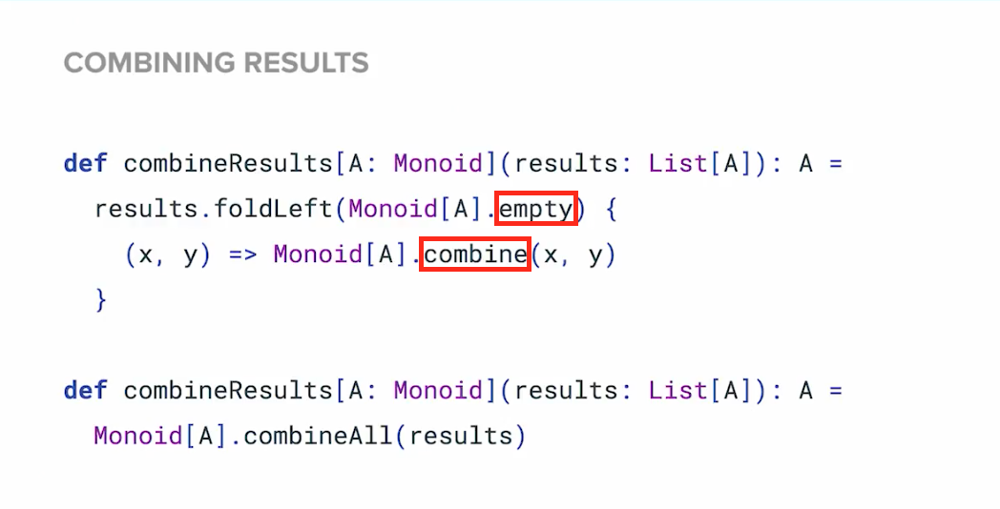
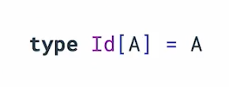

# Cats in Action

We need to pass in an empty to the `foldLeft` and apply `combine` on x & y.

Well, rather than create our own methods for them, the monoid trait contains both for us!

## Testing

Testing wrapped data is a problem. For example, testing a `Future` is more difficult than just testing values.

When working with Cats, we will expect a lot of what we are working with to be wrapped.
However, Cats provides a way to access the value easily.

Think back to how any monoid has an identity! 
